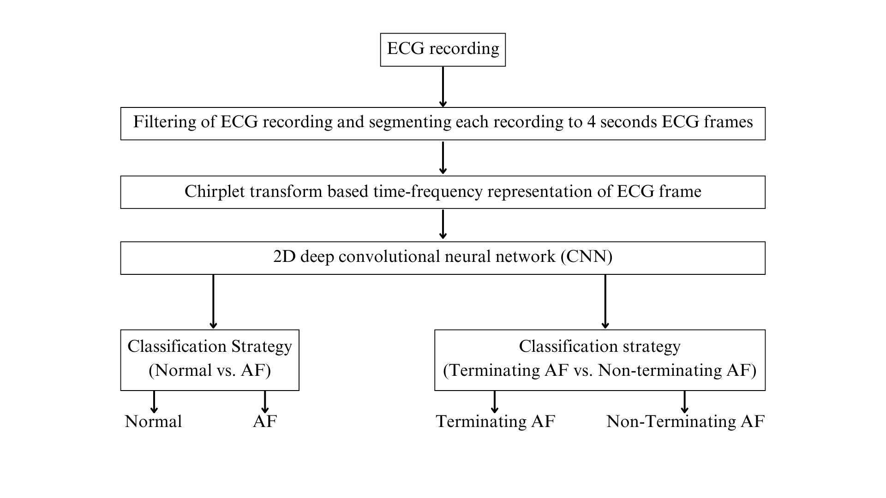
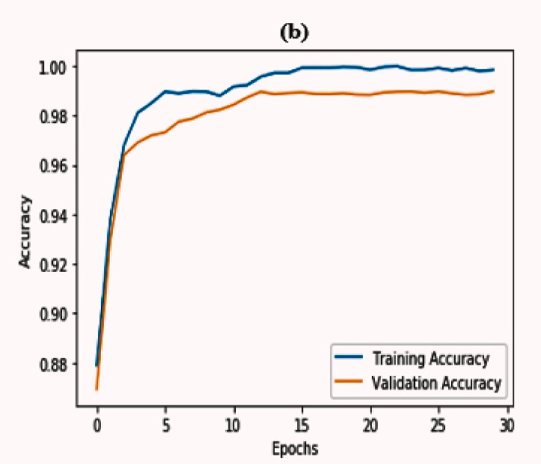
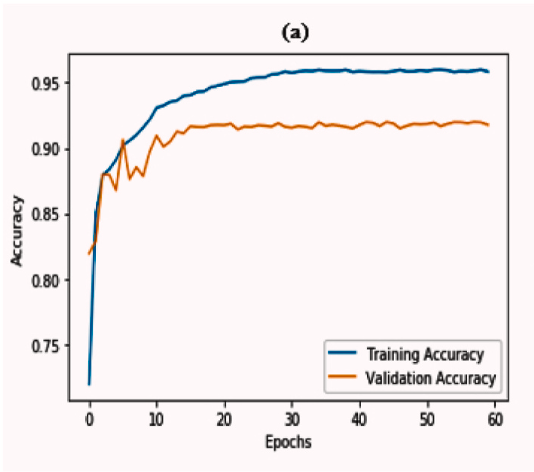
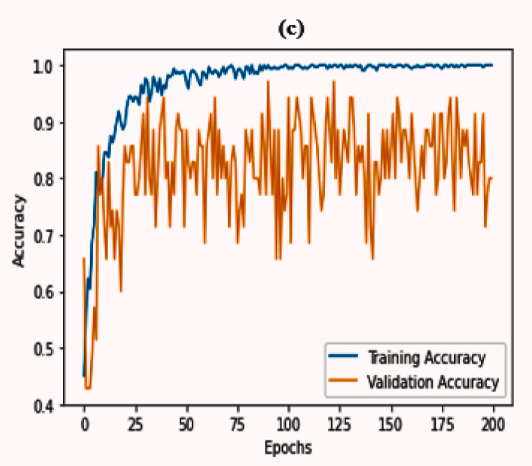

# CardioNet: Automated Atrial Fibrillation Detection using Chirplet Transform and Deep Learning  

## Overview  
CardioNet is an advanced deep learning-based system for **automated detection of atrial fibrillation (AF) using ECG signals**. It leverages **chirplet transform** for time-frequency analysis and a **convolutional bidirectional LSTM network** for high-accuracy classification.  

The model is capable of:  
- **Classifying Normal vs. Atrial Fibrillation (AF) episodes**  
- **Distinguishing between Terminating and Non-Terminating AF**  

## Features  
- **Chirplet Transform for Time-Frequency Analysis**  
- **CNN-BiLSTM Hybrid Architecture for Robust Classification**  
- **High Accuracy: 99.18% for Normal vs. AF Detection**  
- **Evaluated on Multiple Public ECG Datasets**  

---

## Dataset  
CardioNet is trained and evaluated using three publicly available ECG datasets:  
- **Physionet Challenge 2017**  
- **MIT-BIH Atrial Fibrillation Database**  
- **Physionet AF Termination Challenge 2004**  

---

## Model Architecture  

### **1. Preprocessing**  
- ECG signals are denoised using **Butterworth high-pass filtering** and **notch filtering**  
- Signals are segmented into **4-second frames**  

### **2. Feature Extraction**  
- **Chirplet Transform** converts ECG signals into **time-frequency domain representations**  

### **3. Deep Learning Classification**  
- **Convolutional Layers** extract spatial features  
- **Bidirectional LSTM Layer** captures temporal dependencies  
- **Fully Connected Layers** classify AF episodes  

---

## Block diagram of the approach
Below is the high-level block diagram for CardioNet:  

  

---

## Training vs. Validation Accuracy  
Below are the training and validation accuracy graphs for CardioNet:  

<table>
  <tr>
    <th>On MIT-BIH AF database</th>
    <th>On PhysioNet AF challenge database</th>
    <th>On PhysioNet AF termination database</th>
  </tr>
  <tr>
    <td></td>
    <td></td>
    <td></td>
  </tr>
</table>

---

## Installation & Setup  

### **1. Clone the Repository**  
```bash
git clone https://github.com/your-username/CardioNet.git
cd CardioNet
```
### **2. Train the model**
```bash
python train.py --dataset_path /path/to/dataset --epochs 50 --batch_size 32
```
### **3. Evaluate the model**
```bash
python evaluate.py --model_path saved_model.pth --test_data /path/to/test_data
```
---
## Results  

### **Performance Metrics**  

| **Classification Task**                 | **Accuracy** | **F1-Score** | **Sensitivity** | **Specificity** |  
|-----------------------------------------|-------------|-------------|---------------|---------------|  
| **Normal vs. AF**                      | **99.18%**  | **99.24%**  | **99.17%**    | **99.18%**    |  
| **Terminating vs. Non-Terminating AF** | **75.86%**  | **64.08%**  | **74.55%**    | **74.17%**    |  

---
## Future Enhancements  
- **Real-Time ECG Monitoring** for IoT-based healthcare applications  
- **Optimization for Mobile & Wearable Devices**  
- **Larger & More Diverse Dataset Integration**
  
---

## License  
This project is licensed under the **MIT License**. See the [LICENSE](LICENSE) file for details.  
